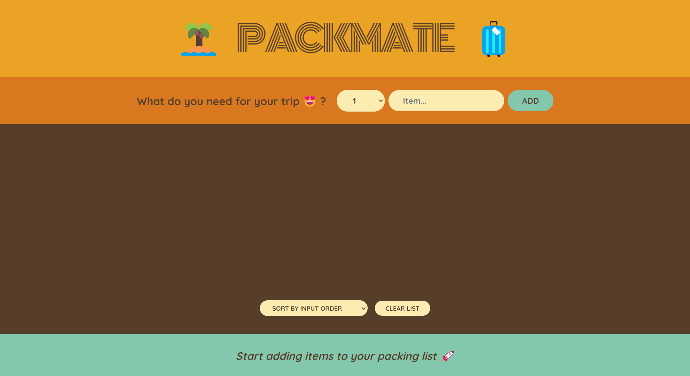
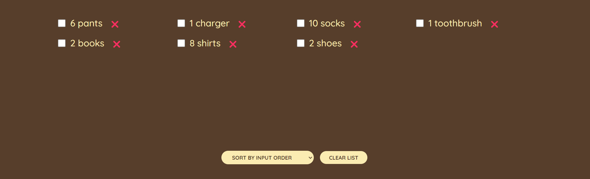
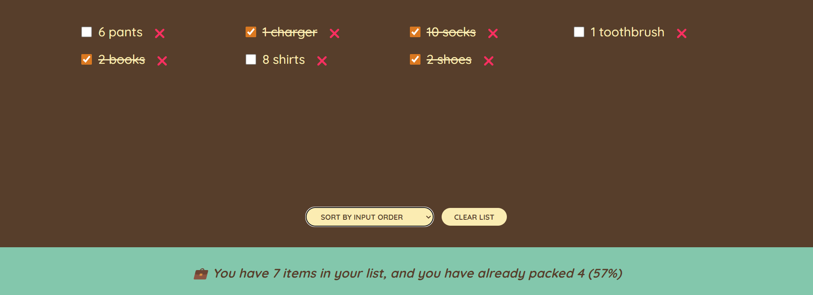
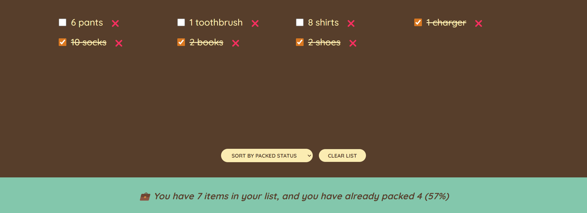
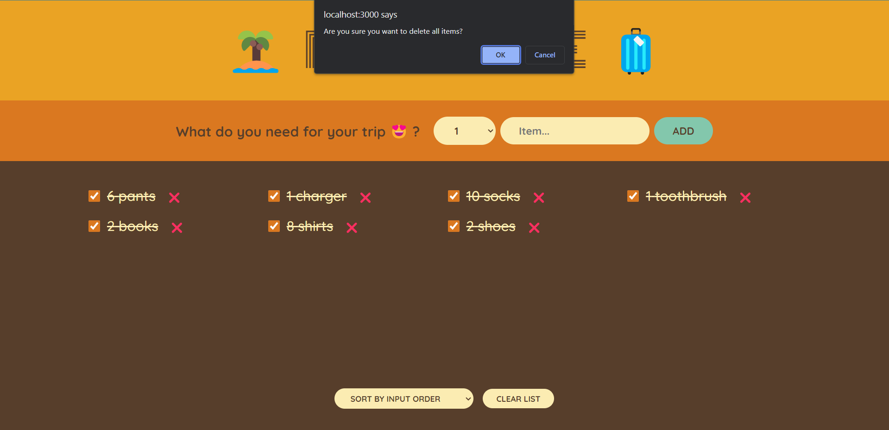

# PackMate

## Description

PackMate is a user-friendly tool for creating and managing your packing list for trips, vacations, and more. Easily add, delete, and check items, and keep track of your packing progress.

## Features

- Add items with quantity and descriptions to your packing list.
- Check off items when they are packed.
- Sort items alphabetically or based on added date or packed status.
- Clear the entire list when you're ready to start fresh.
- Get a summary of your packing progress.

## Getting Started

Follow these steps to run the app on your local machine:

### Prerequisites

- Node.js: Make sure you have Node.js installed on your computer. You can download it [here](https://nodejs.org/).

### Installation

1. Clone this repository to your local machine.
   ```bash
   git clone https://github.com/your-username/packing-list-app.git
   ```
1. Navigate to the project directory.

   ```bash
   cd packing-list-app
   ```

1. Install project dependencies.
   ```
    npm install
   ```

### Running the App

After installing the dependencies, you can run the app locally.

1. Start the development server.
   ```
   npm start
   ```
1. Open your web browser and visit http://localhost:3000 to use the app.

### Usage

- Add items to your packing list.
- Check items when they are packed.
- Sort your list based on your preferences.
- Clear your list when you're ready to start a new one.

### Screenshots

#### Home



This is the app's main interface where you can add and manage your packing list.

#### Add Item Form


Input quantity, description, and click 'Add' to add items to your list.

#### Packing List Overview



View your list with added items.

#### Packed Items and Stats



See your packing list with items marked as packed and get real-time updates on your packing progress.

#### Sorted Packing List with Mixed Status


View your packing list with items both marked as packed and unpacked, sorted by packed status for easy tracking.

#### Clear List Confirmation Alert


When you choose to clear your list, this alert confirms the action, ensuring you don't accidentally delete your items.
